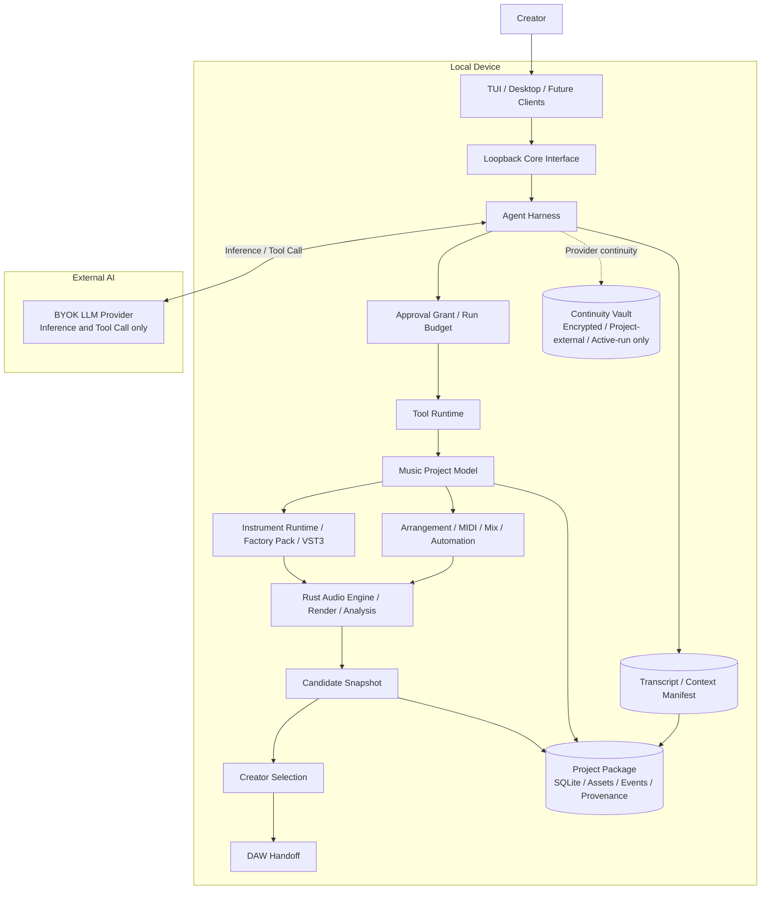

# Auto Studio

> 和 LLM 一起创作音乐，并得到真正可继续制作的工程，而不是一段无法解释的生成音频。

Auto Studio 是一个本地优先的 AI 音乐创作工作站。创作者通过自然语言描述目标、提供反馈并选择方向；LLM 负责作曲、编曲、配器和混音决策，本地 Rust Core 负责验证并执行这些决定，最终形成可编辑、可追溯、可导出的 Music Project。

Auto Studio 不接入外部 prompt-to-WAV Music Provider。唯一必需的外部 AI 连接是创作者自备 Key 的 LLM Provider；音乐工程、MIDI、音色、插件、渲染结果和版本历史保留在本机。

## 项目功能

### 对话式音乐创作

创作者从一个想法或参考方向开始，Agent 将其整理为结构化 Creative Brief，并持续处理类似以下修改：

- 调整段落、速度、拍号和调性；
- 创作或重写和声、旋律、贝斯与鼓；
- 改变指定区域的配器、演奏法和混音；
- 保留未选区域，只迭代创作者指出的问题；
- 在形成候选版本、需要授权或达到资源上限时停止。

### 可编辑 Music Project

音乐事实不会只存在于聊天或生成音频中。目标 Music Project 统一保存：

- Tempo Map、拍号与段落结构；
- Track、MIDI Clip、note、CC、力度与 articulation；
- 乐器分配、路由、Mix 与自动化；
- Project Revision、Candidate、Selection 和依赖锁；
- 素材、音色、插件、许可证和生成过程的 provenance。

LLM 只能调用版本化 Semantic Tool，不能直接写 SQLite、文件、MIDI byte、音频 sample、Shell 或插件 ABI。

### 本地发声与专业交接

Rust Audio Engine 将 Music Project 编译为确定性的本地 Render Plan，并通过 Factory Pack、Sampler 以及受控 VST3 路径产生 Preview、WAV 和 stems。创作者可以比较 Candidate，选择正式工程方向，再导出：

- stereo WAV 与 stems；
- Type-1 MIDI、Tempo、拍号和 section markers；
- 乐器、Content Pack 与插件依赖清单；
- credits、license 与 provenance manifest；
- 面向已验证 DAW 的导入说明和结构化交接产物。

### 可恢复的 Agent Run

Agent Run 使用规范化 Transcript、Context Manifest、Approval Grant 和 Run Budget。系统能够在长对话、上下文压缩、Provider 中断或 Core 重启后，从已提交事实继续运行，同时把可审计记录与 Provider 私有连续性状态分开保存。

Approval 只授权一组受限操作；Selection 仍由创作者决定。允许 Agent 执行，不等于采用它的作品。

## 当前能力边界

当前仓库已经具备独立 Rust Core、loopback API、SQLite Project 持久化、TUI、LLM Connection/Model/Thinking 配置、真实 LLM 结构化 Planning，以及可恢复的 Transcript、Context、Provider Continuity、授权与预算基础设施。

音乐执行闭环仍在建设中：production Music Project Model、通用 Tool Runtime、MIDI Semantic Tool、Sampler、Audio Engine、Factory Pack 和 VST3 Host 尚未完成。因此当前版本属于 **planning-only**，可以连接 LLM 并形成持久化创作计划，但还不能真实生成音乐。

详细进度、证据和未完成 Gate 统一记录在 [Roadmap](docs/roadmap.md)，README 不维护逐项进度流水账。

## 技术架构



### 核心模块

| 模块 | 职责 |
|---|---|
| Client Surface | TUI 是默认入口；Desktop 和未来客户端复用同一个 Core 契约，不拥有业务事实 |
| Core Interface | 提供本机认证 API、版本协商、Project/Run 投影和事件流 |
| Agent Harness | 管理 Turn、Tool Request/Result、上下文、恢复、授权和资源预算 |
| LLM Inference | 适配 OpenAI、Anthropic、DeepSeek、Kimi 等协议，只负责推理与 Tool Call |
| Tool Runtime | 校验 schema、Policy、Approval、Budget、Project Revision，并持久化 ToolExecution |
| Music Project | 保存结构、轨道、MIDI、乐器、Mix、自动化、Candidate 和 Selection |
| Instrument Runtime | 管理 Factory Pack、Sampler、Approved Plugin Profile 与插件隔离 |
| Audio Engine | 编译 Render Plan，执行离线/实时 DSP、渲染和技术分析 |
| Project Package | 保存 SQLite 事实源、不可变资产、备份、依赖和 provenance |

### Workspace 结构

```text
apps/
  core-daemon/          独立本地 Core 进程
  tui/                  默认 autostudio 客户端
  desktop/              Tauri 开发客户端

crates/
  autostudio-core/      领域类型、状态与核心规则
  autostudio-api/       Core HTTP/SSE 契约
  autostudio-provider/  LLM Provider 与推理连续性
  autostudio-storage/   SQLite、revision、事件与备份
  autostudio-media/     媒体资产、探测与交付合同

experiments/
  music-quality/        内容质量与可编辑性实验
  portable-handoff/     MIDI/DAW 交接实验
```

## 设计原则

- **LLM 创作，Core 执行**：模型提出音乐决定，本地 Core 掌握权限、状态变更和渲染。
- **工程事实优先于聊天**：只有通过验证并提交的 Project Change 才代表音乐已经改变。
- **Local-first + BYOK**：工程与媒体留在本机，创作者管理自己的 LLM Credential。
- **有界且可恢复**：所有 Agent Run、ToolExecution、授权和资源消耗都可审计、可停止、可恢复。
- **内容质量优先**：先用固定语料、盲听、Candidate adoption 和 continued editing 证明价值，再扩展模型、工具和插件。
- **Factory Path 独立可用**：没有第三方 VST3 时，内置内容与 Sampler 仍应完成基础创作闭环。
- **专业交接不夸大**：Portable、Structured 和 Sound-identical Handoff 分级声明，只承诺经过验证的 DAW 与依赖组合。

## 未来规划

### 内容可行性验证

先完成冻结音乐语料的真人反馈、盲评、Candidate Keep 和实际继续编辑，确认当前音乐方向值得进入 production 实现，并从失败分布中判断问题属于模型、Tool 粒度、音色还是交接流程。

### 可编辑音乐基础

建立 Music Project Domain、Durable ToolExecution 和固定 Semantic Tool Catalog，让真实 LLM 能创建和局部修改结构、轨道与 MIDI，并通过最小本地音源生成确定性 Preview。

### Factory Quality 纵切

完成可合法分发的 Factory Pack、Sampler、演奏语义、基础 Mix、自动化和技术分析；在没有第三方插件时，仍能生成达到冻结质量阈值的可编辑 Candidate。

### Professional MVP Handoff

在一个首发 OS 上实现隔离且受限的 VST3 Host，验证 state 恢复、freeze 和 crash containment；交付 WAV、stems、MIDI、Tempo/markers、依赖锁与 provenance，并在冻结版本的目标 DAW 中验证继续制作。

### 发布资格

冻结首发用户、OS、模型和 DAW 矩阵，完成 Credential Vault、安装与升级、签名、公证、SBOM、许可证、安全、性能、soak test 以及设计伙伴采用验证。

依赖顺序、完成定义和 Release Gates 见 [Roadmap](docs/roadmap.md)。

## 快速开始

需要 Rust 1.96.1。安装 Core 与 TUI：

```bash
cargo install --path apps/core-daemon --locked
cargo install --path apps/tui --locked
autostudio
```

首次进入后使用 `/connect` 配置 LLM Provider，再通过 `/model` 选择模型与 Thinking Level。普通文本会创建或打开 Project、保存 Creative Brief，并进入当前 Planning 流程。

不安装时可以直接运行：

```bash
cargo build -p core-daemon
cargo run -p autostudio-tui --bin autostudio
```

Desktop 是复用相同 Core Interface 的次要开发客户端，启动方式见 [Desktop README](apps/desktop/README.md)。

## 开发验证

```bash
cargo fmt --all --check
cargo test --workspace --all-targets
cargo clippy --workspace --all-targets -- -D warnings
./scripts/check-crate-boundaries.sh
cd apps/desktop && pnpm build
```

真实 Provider 测试只在显式提供 Credential 时运行；缺少 Key 的 `SKIP` 不代表通过。

## 文档

- [文档导航与权威顺序](docs/README.md)
- [产品设计](docs/product/ai-creative-agent-product-design.md)
- [技术设计](docs/design/auto-studio-technical-design.md)
- [Roadmap](docs/roadmap.md)
- [共同语言](CONTEXT.md)
- [ADR-0011：由 LLM 通过本地工具创作可编辑音乐](docs/adr/0011-llm-authored-local-music.md)
- [ADR-0012：推理记录、Provider 连续性、授权与预算](docs/adr/0012-durable-agent-harness-state.md)
