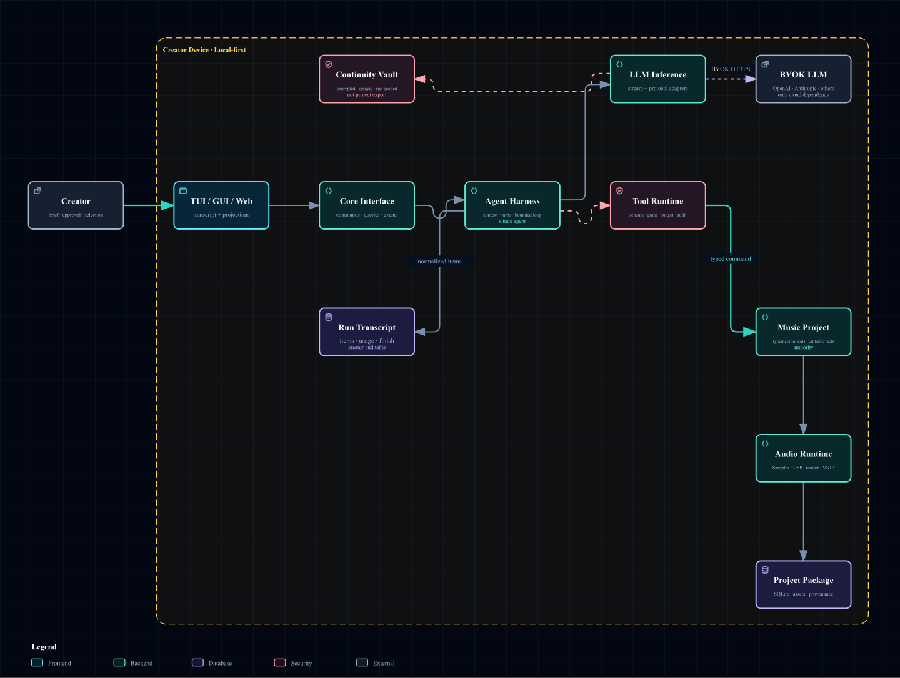
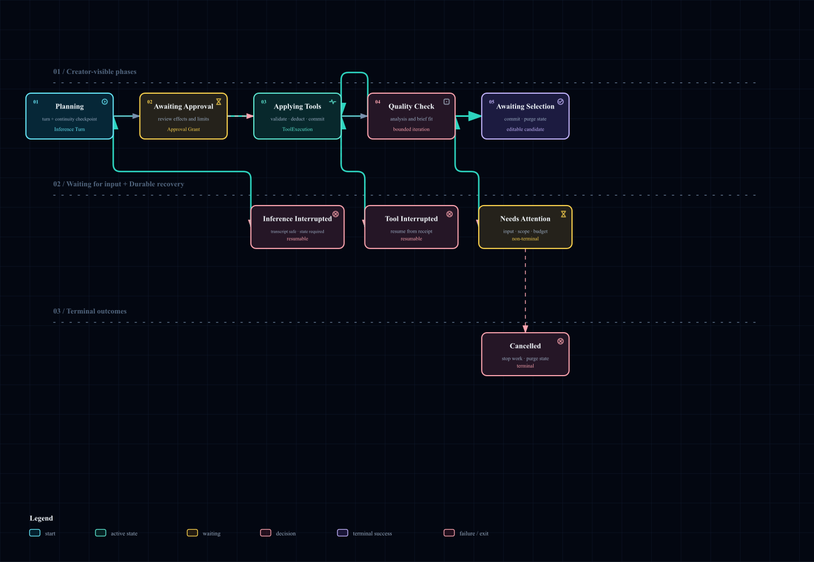
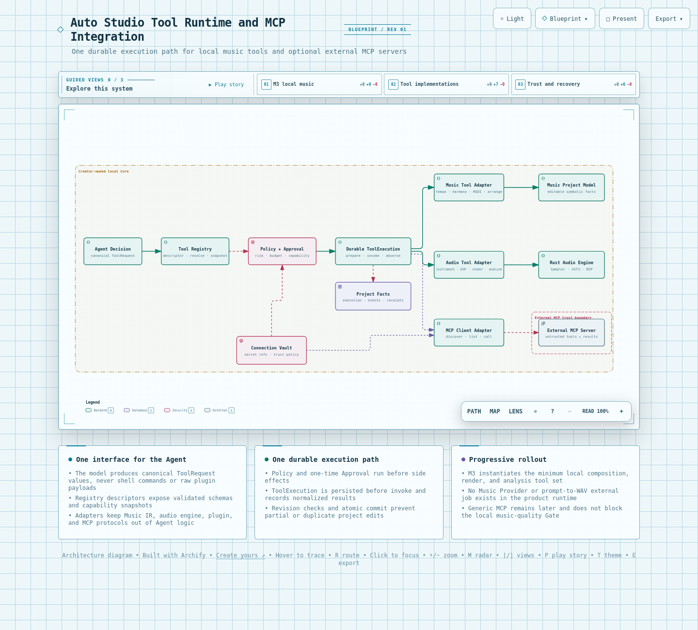

# Auto Studio 技术设计文档

> 基线日期：2026-08-26
> 目标：由真实 LLM 驱动本地音乐工具，产生可编辑 Music Project 与本地渲染音频  
> 当前事实：Core/TUI/Project/SQLite/LLM Connection 与 Planning 已实现；M3-A CM-0/CM-1/CM-2 已把 Run/Turn/Item identity、durable Inference Transcript、Context Manifest、三种协议的 SSE assembler、完整 ToolRequest/ToolResult、每步 replay、Planning resume 与 Project 外加密 Continuity Vault 接入 production 路径。CM-3 planning slice 已实现 automatic safe-cut、bounded structured summary、有效缩短 Gate、同事务 crash 语义、大 Tool Result spill 与最多一次 Provider overflow recovery；完整 Transcript、Project facts 与 Tool Result 不改写。固定链路先执行真实只读 `project_describe`，再接受 `submit_creative_plan`；仅有 `ContextPrepared` 而无 Provider 输出的中断不会自动重提。OpenAI Responses reasoning item 与 Anthropic signed thinking block 已通过捕获/回传 contract；2026-08-26 `gpt-5-mini` 已通过完整两轮 Continuity live，包括跨 Turn replay 与终态 Vault purge。Q0 v2/v3 与 Portable Handoff 的机器证据保持有效，但真人内容/正式跨 DAW Gate 尚未完成。CM-4 长 Run retrieval、Approval Grant、Run Budget、通用 Tool Registry/ToolExecution、Music Project Model、Sampler、Audio Engine、Factory Pack 和 VST3 Host 尚未实现；超长 single-turn 无安全 cut 时会 fail closed，Provider-specific tokenizer 与真实 overflow live 仍待资格验证。现有 `GenerationAdapter` 与确定性 WAV Fixture 是旧方向的测试代码，不属于目标 production runtime。

## 1. 决策摘要

Auto Studio 采用单一 Rust Core。LLM 通过 BYOK Provider 完成理解、规划和音乐决策，再调用 Core 注册的 Semantic Tool；所有作曲、MIDI、乐器、DSP、渲染、分析和 Project 提交发生在本机。

| 关注点 | 决策 |
|---|---|
| 音乐生成 | LLM 生成结构化音乐决策并修改本地 Music Project，不调用 Music Provider |
| 外部依赖 | 只有 LLM Inference 需要外部 Provider；Project、内容、插件和音频执行在本地 |
| Agent | 单 Agent、有界多轮 Tool loop；不采用角色式 Multi-Agent |
| 推理状态 | 可审计 Inference Transcript 与 opaque Provider Continuity State 分开保存 |
| 授权与上限 | Approval Grant、Run Budget、Tool Resource Limit 分开判定 |
| 工具 | LLM 只调用版本化 Semantic Tool，不接触 crate 函数、Shell、路径、SQL 或 VST3 ABI |
| 工程事实 | Music Project Model、Project Snapshot、Event 和 SQLite 是事实源，聊天不是 |
| 音频 | Rust Audio Engine 编译不可变 Render Plan；M3 先离线渲染，实时 callback 后续按同一 graph semantics 进入 |
| 音色 | Factory Pack + Sampler 保证基础路径；VST3 是隔离、Profile 约束的 MVP 专业路径 |
| 客户端 | `autostudio` TUI 为首发入口，GUI/Web 通过相同 Core Interface 接入 |
| MCP | 以后作为受控 Tool Adapter 接入；不参与基础音乐闭环，也不能替代本地音乐工具 |

最重要的技术边界是：

> LLM 可以决定“写什么音乐”，但只有 Core 可以决定“这个工具请求是否有效、是否允许、如何改变工程，以及如何渲染”。

## 2. 总体架构

### 2.1 给非技术读者的解释

可以把系统理解为一间由 AI 协作的本地录音室：

- **LLM** 是作曲人与制作助理，提出结构、旋律、配器和混音决定；
- **Tool Runtime** 是录音室管理员，检查每个决定是否合法、是否得到授权；
- **Inference Transcript** 是可审计的工作记录；**Continuity Vault** 是只为继续当前 Provider 链而存在的加密临时封套；
- **Music Project Model** 是总谱和工程文件，保存所有可编辑音乐事实；
- **Instrument Runtime** 是乐手与音色，包括 Factory Pack、Sampler 和已批准 VST3；
- **Rust Audio Engine** 是调音台与渲染系统，把工程变成可以听到的音频；
- **Project Package** 是保险柜，保存版本、资产、来源和恢复记录。

外部 LLM 不返回最终音乐文件，也不能直接碰 Project。它只返回经过 schema 约束的 ToolRequest。

### 2.2 架构图



可交互查看、搜索并切换视图：[Agent Harness 架构图](agent-harness-architecture.html)。

图中的主路径是：

```text
Creator
  → TUI / GUI / Web
  → Core Interface
  → Agent Harness
  ↔ LLM Inference / BYOK LLM
  → Approval Grant + Run Budget
  → Tool Runtime
  → Music Project Model
  → Rust Audio Engine
  → Project Package
```

Agent Harness 同时把规范化条目写入 Inference Transcript，并让 Provider Adapter 把 opaque continuity 写入 Project 外的 Continuity Vault。两者不能互相替代。`BYOK LLM` 是唯一跨出设备的必需连接；图中没有 Music Provider、远端音乐 Job 或 prompt-to-WAV fallback。

### 2.3 当前 CM-3 Context Surface 实例化架构图

下面这张图只画已经进入 production Planning 路径的代码，不把目标模块伪装为现状。非技术读法是：每走一步，系统都先翻开“工程事实”和“工作记录”，再决定下一步；Provider 只给出工具请求，本地 Core 负责执行和落盘。

```mermaid
flowchart LR
    Creator[Creator] --> Client[TUI / Desktop]
    Client --> API[Loopback Core API]
    API --> Planner[AgentPlanner drive / resume]

    Planner -->|每一步重新打开| Project[ProjectService\nplanning Run / Brief / revision]
    Planner -->|inspect / prepare / append| Context[ContextManager]
    Context <--> SQLite[(Project SQLite\nTranscript + Manifest + Checkpoint + Spill Blob)]
    Context --> Checkpoint[Compaction Checkpoint\nstructured summary + prefix cut + hash]
    Checkpoint -->|单事件 CAS 原子提交| SQLite
    SQLite -->|重启 replay| Context
    Context --> Initial[Initial Context Surface\nlatest summary + kept raw tail]
    Initial --> SpillPolicy[Deterministic Spill Policy\nTool Result > 16 KiB]
    SpillPolicy -->|完整内容 + SHA-256\n同事务提交| SQLite
    SpillPolicy --> Surface[Prepared Context Surface\n512-char preview + stable reference]
    Surface --> Footprint[Request Footprint\nbytes + host safety ceiling\nnormal / soft / hard / overflow]

    Footprint -->|normal / soft| Prepared[ContextPrepared Manifest]
    Footprint -->|hard / overflow| AutoCompact[Automatic Compaction Policy]
    AutoCompact --> Cut[Safe cut\n完整 Turn 边界 + Tool pair\n保留新输入和最近两轮]
    Cut --> Summary[Bounded Structured Summary\nobjective / decisions / constraints\ncompleted work / artifact refs]
    Summary --> Verify[Effectiveness Gate\n实际变短且回到 Normal]
    Verify -->|PASS| Atomic[同事务提交\nnew input + checkpoint + Manifest + spill]
    Verify -.->|无安全有效 cut| Stop[明确失败，不调用 Provider]
    Atomic --> SQLite
    Atomic --> Prepared
    Prepared --> Planner
    Planner --> Adapter[LLM Provider Adapter]
    Adapter --> Wire[OpenAI Chat / Responses\nAnthropic Messages SSE]
    Wire --> Assembler[Provider-neutral stream assembler]
    Assembler -->|完整 canonical Turn| Context
    Wire -.->|明确 context overflow| Overflow[记录 ContextOverflow Finish]
    Overflow --> Purge[清除旧 Provider Continuity]
    Purge -->|第一次| AutoCompact
    Purge -.->|第二次| Stop

    Planner -->|精确 binding load / store / purge| Vault[(Project 外 Continuity Vault\nXChaCha20-Poly1305 + TTL)]
    Vault -->|opaque state 仅交给兼容 Adapter| Planner
    Context -->|Manifest 仅保存非秘密 reference| SQLite

    Planner --> FixedTools[固定 Planning Tool Module]
    FixedTools --> Describe[project_describe\n真实本地只读]
    Describe --> Project
    FixedTools --> Submit[submit_creative_plan\n校验 terminal plan]
    FixedTools -->|完整 ToolResult| Context

    Submit -->|独立 Project transaction| Approval[Agent Plan\nawaiting_approval]

    classDef pending fill:#2b2238,stroke:#ff4fd8,color:#ffffff;
    classDef durable fill:#102b38,stroke:#39ffdf,color:#ffffff;
    class SQLite,Project,Vault,Checkpoint durable;
    class Adapter,Wire,Assembler,Initial,SpillPolicy,Surface,Footprint,AutoCompact,Cut,Summary,Verify,Atomic,Prepared,Overflow,Purge,Stop,FixedTools,Describe,Submit pending;
```



图中的 Vault 与 Project SQLite 是两个存储域：SQLite 保存可审计 Transcript、Manifest、不含 payload 的 `ContinuityReference`、只改变模型视图的 Compaction Checkpoint Event，以及可由 hash 校验的 Tool Result spill blob；Provider 私密 payload 只进入应用私有 Vault。Checkpoint 和 spill 都不删除 Transcript，也不修改 Project facts。Context Manager 在 hard/overflow 压力下自动选择完整 Turn 边界的安全 cut，至少保留新输入和最近两轮；只有压缩后实际更短并回到 `Normal` 才把新输入、Checkpoint、Manifest 与 spill 同事务发布。明确的 Provider overflow 会先落盘 Finish 并清除旧 Continuity，只允许一次恢复。三种 Provider wire 都把摘要作为 untrusted user context，不能提升成 system/policy。图中仍没有 CM-4 retrieval、Music Project、Audio Engine 或通用 Tool Runtime。`project_describe` 和 `submit_creative_plan` 是固定内部 Tool Module，不替代 M3-C 的版本化 Registry、Policy、Grant、Budget 与 durable ToolExecution。

## 3. 当前实例化架构与目标架构

必须区分“代码已经存在”和“目标设计已经确定”。

### 3.1 当前代码证据

| 能力 | 状态 | 证据边界 |
|---|---|---|
| Rust workspace 与独立 Core | `PASS` | Axum Core、版本化本机 API、discovery/session |
| Project/SQLite/revision/event/outbox | `PASS` | Project 创建、打开、提交、备份与恢复测试 |
| TUI `/connect`、`/model`、Thinking、`/exit` | `PASS` | Ratatui reducer/UI 与 Core Connection 合同 |
| LLM Adapter | `PASS（contract + DeepSeek/OpenAI live）` | OpenAI/Anthropic/DeepSeek 等协议合同；2026-08-25 `deepseek-v4-flash` 真实流式 Tool Call smoke；2026-08-26 `gpt-5-mini` 两轮 Responses Continuity live |
| LLM Planning | `PASS（CM-1 contract）` | SSE canonical Turn；`project_describe → submit_creative_plan` 两轮链路；typed Plan 与 Approval 已接 production composition root |
| Q0 实验 Harness | `PASS（v2/v3/portable machine）` / `LIVE-PENDING（human）` | 真实 DeepSeek V4 Pro、Mode A/B/C、逐轮落盘/任意已落盘 B 回合恢复、strict spec、SMF compiler；v3 protocol binding、受限资源修订与 formal verifier 通过；Portable v1 增加 InstrumentAssignment、CC0/CC32/Program Change 和 assignment manifest |
| Inference Transcript/Context Manifest | `PASS（CM-3 planning slice）` | Run/Turn/Item、完整 Visible/Tool/Usage/Finish、SQLite append/CAS、精确 Manifest、三协议 stream assembler、完整 pair 校验、重启 replay；automatic safe-cut、bounded summary、effectiveness Gate、atomic crash/retry、spill/backup 与单次 overflow recovery | CM-4 长 Run retrieval、exact tokenizer/live overflow qualification 未实现 |
| Agent Run lifecycle | `PASS（CM-1/CM-2 contract）` | 首次 LLM 调用前 `agent_run.started`；每步 replay；pending Tool/complete Plan 恢复；ambiguous prepared Turn 安全失败；API/TUI/Desktop resume；终态前清理 continuity |
| Provider Continuity Vault | `PASS（CM-2 contract + OpenAI live）` / `LIVE-PENDING（Anthropic / OS Vault）` | OpenAI Responses reasoning/function item、Anthropic signed thinking/tool-use block；XChaCha20-Poly1305、独立密钥、精确 binding、TTL、启动/周期 janitor、错配/损坏清理、终态 purge 与 sentinel 隔离测试；`gpt-5-mini` 实测完成 2 Turn、777 input/385 output tokens 和终态 purge |
| Candidate/Selection/Handoff | `PASS（Fixture/已有 WAV）` | 只证明本地资产合同，不证明 LLM 已创作真实音乐 |
| Music Project Model | `NOT IMPLEMENTED` | 当前 Project 只有 Audio Clip 路径，没有完整 symbolic music facts |
| 固定 Planning Tool loop | `PASS（CM-1 contract）` | 内部 `project_describe` 与 `submit_creative_plan`，有真实本地只读执行、完整 Request/Result 与有界循环 |
| 通用 Tool Registry/ToolExecution | `NOT IMPLEMENTED` | 尚无版本化 catalog、Policy/Grant/Budget、通用执行状态机或 Music Project Tool |
| MIDI | `PASS（Q0 experiment）` / `NOT IMPLEMENTED（production）` | Q0 可确定输出 Type-1 SMF 与可审计乐器意图；production Music Project/Tool/Export 尚不存在 |
| Sampler/Factory Pack | `NOT IMPLEMENTED` | production workspace 未引入对应运行模块；GeneralUser GS 仅获批本地 Q0 评价，不可视为 Factory Pack |
| Rust Audio Engine | `NOT IMPLEMENTED` | 当前仅使用 `hound` 做 WAV 合同，没有 graph/render engine |
| VST3 Host | `NOT IMPLEMENTED` | 没有扫描、隔离、IPC、Profile 或 corpus 证据 |
| MCP Client | `NOT IMPLEMENTED` | 只有目标文档，没有注册/发现/调用代码 |

结论：当前产品仍是 `planning-only`。旧 `GenerationAdapter` 的 Fixture 可以继续帮助迁移测试，但不得进入 release composition root，也不能被计为真实音乐能力。

### 3.2 Q0 前置 Gate

M3 开工前先按 [Q0 音乐内容可行性 Spike](../planning/2026-08-24-music-quality-spike-design.md) 验证 L1—L4 结构化音乐决定。Q0 只产生 ExperimentalMusicSpec、Portable MIDI、乐器分配清单和固定 DAW 评价证据；不实例化 Audio Engine、Factory Pack、VST3，也不把实验 schema/catalog 当成 production Tool Interface。Q0 未得到 `GO` 前，M3 保持目标设计状态。

Q0 的当前实例化架构如下。读法是：上半部分负责“让真实模型产生可检查的音乐事实”，下半部分负责“证明证据没有漂移，再交给人听和继续编辑”。

```text
┌──────────────────────────── 冻结输入 ────────────────────────────┐
│ corpus-v1 · prompt-v1 · JSON Schema · DeepSeek V4 Pro/high      │
│ protocol v2/v3 lock · price snapshot · Bitwig recipe · mapping  │
└──────────────────────────────┬───────────────────────────────────┘
                               │ exact hash / identity
                               ▼
┌────────────────────── Q0 Runner（真实网络）──────────────────────┐
│ Mode A：一次完整 spec                                              │
│ Mode B：skeleton → arrangement → validation revision              │
│ v3 L4：仅全局 note/CC budget 错误时，最多一次完整 spec repair         │
│ Mode C：B spec + 1—2 条真实 Creator feedback                       │
│                                                                  │
│ 每个 Provider turn 先原子落盘；中断从最后已落盘 B turn 继续，不重复调用  │
└──────────────────────────────┬───────────────────────────────────┘
                               │ visible JSON only
                               ▼
┌─────────────── 严格校验与编译 ───────────────┐
│ deny unknown fields · musical/resource invariants                 │
│ semantic track → frozen Instrument Profile → MIDI channel         │
│ ExperimentalMusicSpec → Type-1 SMF / 480 PPQ                      │
│ tempo · meter · key · marker · track · Bank/Program · note · CC   │
│                     + instrument-assignments.json                  │
└──────────────────────────────┬───────────────────────────────────┘
                               ▼
┌──────────────────────── 证据与 Gate ─────────────────────────────┐
│ run/turn/spec/MIDI + SHA-256 + tokens/cache/latency/cost          │
│ Formal Verifier：v2 精确 4 A + 12 B；v3 精确 6 L4 B + binding        │
│ Blind Pack：evaluator 目录不含 mode；private map 与评价包分离          │
└──────────────────────────────┬───────────────────────────────────┘
                               ▼
           frozen DAW import matrix → blind Keep → Creator edit
        （Bitwig 仅有手动 Pilot；正式 matrix/内容证据仍需真人完成）
```

安全边界：API Key 只从环境读取并在 drop 时清零；Provider private reasoning 不进入 turn、Project 或评审包；SoundFont 只被本机 recipe 引用，不复制进仓库。`experiments/music-quality/` 有独立 `[workspace]` 和 lockfile，不能被 production composition root 引用。

### 3.3 M3 实例化目标

M3 只实例化完成本地纵切所需的最小 Module：

1. Harness Foundation：Inference Transcript、Inference Item、Continuity Vault、Approval Grant、Run Budget；
2. Music Project Model；
3. 固定 Tool Registry；
4. Durable ToolExecution；
5. 有界 LLM Tool loop；
6. 最小 MIDI/arrangement 工具；
7. 确定性本地离线渲染与技术分析；
8. Candidate Project Snapshot。

M3 不需要 MCP、视频、Multi-Agent、完整实时设备、任意插件兼容或新的通用工作流平台。

## 4. 模块与 seam

### 4.1 Core Interface Module

**Interface**：版本化 command、query、event stream、expected revision、错误码与本机认证。  
**Implementation**：Axum HTTP、SSE、discovery、session 和 Client DTO。  
**不负责**：LLM 协议、音频设备、VST3 或 SQLite 细节。

Client 只知道业务资源，例如 Project、RunProjection、Candidate 和 Render；TUI/GUI 不得从日志文本推断状态。

### 4.2 Agent Harness Module

**Interface**：

```rust
pub trait CreativeAgentRuntime {
    async fn start(&self, command: StartRun) -> Result<RunProjection, AgentError>;
    async fn resume(&self, run_id: RunId) -> Result<RunProjection, AgentError>;
    async fn cancel(&self, run_id: RunId) -> Result<RunProjection, AgentError>;
}
```

调用者不需要理解 prompt construction、Provider stream、tool-call parsing、context compaction、recovery 或循环预算。Module 内部负责：

- 从 Project Snapshot 构造 Context Snapshot；
- 调用 LLM Inference Module；
- 把完整、规范化 Inference Item 追加到 Transcript；
- 保存/加载与精确 Provider 链绑定的 opaque continuity reference；
- 交给 Tool Runtime 准备/执行；
- 把 Tool Result 作为新的可见上下文；
- 在达到 Candidate、需要用户输入、预算耗尽或失败时停止。

Agent Harness 不负责音乐工程的具体不变量；这些由 Music Project Module 和 Tool implementation 持有。

### 4.3 LLM Inference Module

它是现有 `autostudio-provider` 的保留职责。窄 Interface 是：

```rust
pub trait LlmInference {
    async fn turn(
        &self,
        request: InferenceTurnRequest,
    ) -> Result<InferenceStream, InferenceError>;
}
```

`InferenceTurnRequest` 只接受 canonical messages/tool definitions、精确 Provider/Model/Protocol、Thinking Level 和兼容 continuity reference。`InferenceStream` 产生 visible delta、tool-call delta、usage、finish reason 与最终 continuity update。Adapter 负责把 wire event 组装为 canonical item；Harness 不解析 Provider JSON。

统一 Interface 表达：

- Provider/Model/Protocol；
- system/user/assistant/tool messages；
- tool definitions；
- visible text delta；
- complete tool-call delta；
- usage、finish reason 和 Provider continuity state；
- Thinking Level 的模型级能力映射。

OpenAI、Anthropic、DeepSeek、Kimi 等是这个 seam 上的真实 Adapter。Provider 专有 JSON、header、stream event 和错误停留在 Adapter 内。

Tool forcing 也属于 Adapter 差异：OpenAI Responses 与普通 Chat 路径使用 `required`，Anthropic adaptive thinking 使用 `any`；DeepSeek thinking mode 会拒绝 `required`，因此该组合使用 `auto`，同时本轮 catalog 只暴露一个工具并由 Core 在返回后做名称、fingerprint 与参数校验。DeepSeek `Off` 档仍可使用 `required`。这一映射由 wire contract 与真实 DeepSeek smoke 共同验证，不能在 Harness 中写成一个全局开关。

LLM 中断与本地音乐工具失败分开：LLM 请求可能产生 `Interrupted` 或 `UnknownConsumption`，但没有完整 ToolRequest 就不会改变 Project。

#### 4.3.1 Inference Transcript

Transcript 是 Run 内的 durable semantic log，不是聊天字符串数组：

```rust
pub enum InferenceItem {
    VisibleMessage(VisibleMessage),
    ToolRequest(CompleteToolRequest),
    ToolResult(RecordedToolResult),
    Usage(InferenceUsage),
    Finish(InferenceFinish),
}
```

每个 item 带 `item_id`、`run_id`、`turn_id`、单调 sequence、时间与内容 hash。partial text/tool JSON 只存在于 `StreamingTurnAssembler` 内存缓冲；完成事件到达、Tool identity 完整且参数可解析为 JSON 后，才会产生 canonical ToolRequest。OpenAI Chat、OpenAI Responses、Anthropic Messages 分别只负责把厂商 SSE event 映射成统一 delta；private reasoning/thinking/signature 没有 Transcript variant。支持协议连续性的完整 opaque item/block 会交给 Adapter-owned Continuity State，其他私密 delta 被忽略，二者都不会变成可见消息。Transcript 可供 Creator 审计和 Context 重建，但不能直接改变 Project。

当前 Context Module 收进五个窄 Interface；压缩策略仍由 Module 内部拥有，调用者不能直接改写 Transcript：

```rust
ContextManager::prepare_turn(PrepareContext) -> PreparedContext
ContextManager::record_turn(RecordInferenceTurn) -> RecordedInferenceTurn
ContextManager::record_tool_results(RecordToolResults) -> RecordedInferenceTurn
ContextManager::inspect_run(run_id) -> ContextProjection
ContextManager::commit_compaction(CommitCompaction) -> RecordedCompaction
```

`prepare_turn` 先从 `ContextEventStore` replay 当前 Run，校验 event/item sequence、内容 hash、Tool pair 与 checkpoint 链，拒绝在 pending ToolRequest 尚未完成时准备下一轮；再加入新的 Creator 消息并派生 current surface。没有 checkpoint 时 surface 是完整历史；存在 checkpoint 时是一个 `ContextSummary` 加上 `first_kept_item_id` 起的原文 tail。Context Manager 随后完成测量、spill 和压力判定，最后把当前 Project id/revision binding、本轮 Tool schema、精确 surface 与审计指标写入不可变 `ContextManifest`。Manifest 绑定 Provider/Model/Protocol/Thinking/capability/mapping/tool-catalog、token budget、最新 checkpoint identity、`ContextSurfaceMetrics` 与整份 canonical input hash。只有 Manifest 与本轮 spill blob 成功落盘，`InferenceTurnRequest` 才能交给 Provider Adapter。

`ContextFootprint` 不声称等于 Provider 的最终计费 token。它先用 canonical JSON 序列化分别记录 instructions、messages、Tool schema 和总字节数，再以版本化的保守系数 `3 bytes/token` 向上估算，并加上 Adapter 从 opaque continuity payload 大小推导的 allowance；Core 不读取或记录私密 payload。输入预算未知时标记 `unknown`，已知时按 `<75% normal`、`>=75% soft`、`>=90% hard`、`>100% overflow` 分级。production Planning 当前统一使用 `16,384` token 的 host-owned safety ceiling，预留 `4,096` output 和 `1,024` safety；这是 Harness 自身的保守上限，不是对任一模型窗口的能力声明。`soft` 允许本轮继续；`hard/overflow` 先进入 automatic compaction，只有无法找到安全且有效的 cut 才在 Provider 前失败。未来可在不改变压力合同的前提下，用 Provider-specific tokenizer 校准 estimator。

spill 是确定性的 current-surface 变换，不是删除：任何进入模型视图且 UTF-8 内容超过 `16 KiB` 的完整 Tool Result，都会被替换为 `512` 个 Unicode 字符的预览，以及 `sourceItemId`、`contentHash`、`originalBytes` 和恢复引用。原始 Tool Result 仍保留在完整 Transcript；相同内容产生相同 SHA-256 identity，并存入 SQLite `inference_context_spills`。spill blob、Creator 新消息与 `ContextPrepared` Event 使用同一 transaction，revision 冲突会全部回滚。读取和 backup 恢复都会重新校验 byte count 与 hash；Manifest 同时记录 initial/prepared footprint，并拒绝“声称 spill 但请求没有实际变短”的损坏数据。该设计目前减少模型输入，不减少 Project 文件大小。

`commit_compaction` 保留为显式 host-owned checkpoint 入口；production `prepare_turn` 现在还内置 automatic policy。它只枚举完整 Inference Turn 边界，cut 必须是从 Transcript 开头开始并比上一 checkpoint 推进的连续前缀，不能拆 Tool Request/Result，不能移除本轮新输入，并至少保留最近两个 Turn。摘要由 Core 确定性生成，字段固定为 objective、Creator decisions、constraints、completed work、open items 与 artifact execution references；每项有字符/数量上限，不包含 private reasoning。候选 surface 必须比 initial surface 更小并回到 `Normal`，否则继续推进 cut；没有候选时返回 `AutomaticCompactionUnavailable`，绝不带着超限输入调用 Provider。

automatic compaction 不建立可中断的付费外部任务，因此不需要独立 `attempt_started` 事实：本轮 Creator item、`context.compaction_committed`、`context.prepared` 和 spill blob 由一次 SQLite compare-and-swap transaction 发布。事务前崩溃等于什么也没发生；事务后重启会看到全部事实。确定性故障注入证明失败没有残留 item/checkpoint/Manifest，使用相同 source facts 重试会得到相同 checkpoint content hash。checkpoint 的随机 id 和记录时间不参与 hash；replay 会重新验证 hash、cut、Turn/Tool pair 与 Manifest binding。完整 Transcript、Usage、Finish 和 Tool pair 从不被删除。

Provider Adapter 只把明确的机器码或错误短语（例如 `context_length_exceeded`、`context_window_exceeded`、`prompt_too_long`、`maximum context length`）分类为 `ContextOverflow`；普通 HTTP 400 仍是 `Rejected`，避免把 schema/Tool 错误误判为可重试。overflow Finish 先进入 Transcript，旧 Provider Continuity 随即清除；下一次 `prepare_turn` 即使本地估算为 Normal 也必须推进 compaction。一个 Run 只允许一份 `ProviderOverflowRecovery` Manifest；若 Provider 再次 overflow，下一步返回 `OverflowRecoveryExhausted`，因此不存在无限重提。OpenAI Responses/Anthropic SSE 与 HTTP 错误分类已有本地 contract，但真实 Provider overflow live 仍是资格验证项。

CM-3 planning slice 到此完成。已知限制是：Provider-specific 精确 tokenizer 尚未校准；超长 single-turn 因必须保留新输入和最近 Turn，在没有安全 cut 时 fail closed；CM-4 才负责从已经退出 current surface 的历史中检索 source-linked 事实。对模型可见的 summary 在 OpenAI Chat、OpenAI Responses、Anthropic Messages 中都映射为 user content，外部内容不能借 compaction 升级为 system/policy。

`record_turn` 使用 journal expected revision 防止两个写入者覆盖，只接收完整 Provider Turn，并校验每个 ToolRequest 都存在于该 Manifest 的 Tool catalog、descriptor fingerprint 完全相同。ToolResult 不能走这个入口；`record_tool_results` 必须把每个结果匹配到一个 pending Request，拒绝 orphan、重复 call id 和名称错配。`inspect_run` 输出 journal revision、完整 items/manifests、pending Tool 列表和“已准备但无输出”的 Turn，用作唯一恢复投影。

`AgentPlanner::drive` 是有界循环（当前最多 8 个 Inference Turn、24 个派生步骤），但不保存一份可恢复的内存消息数组。每次迭代都重新打开 Project、调用 `inspect_run`，再按以下顺序决策：

1. 已有成功的 `submit_creative_plan` Request/Result：从耐久参数、Manifest binding、累计 Usage 和 Provider response id 构造 `AgentPlanDraft`，单独提交 Project transaction；
2. 有 pending ToolRequest：在最新 Project 上执行固定本地 Tool，完整 Result 落盘后重新开始循环；
3. 只有 `ContextPrepared`、没有任何 Provider output：返回 `InterruptedTurn`，Run 以 `inference_interrupted` 失败，不自动重提可能已经计费的请求；
4. 其余状态：根据耐久 transcript 选择本轮唯一 Tool schema，准备新 Manifest，再调用 Provider。

固定阶段始终提供同一份稳定 catalog：`project_describe` 与 `submit_creative_plan`。前者真实读取当前 Project id、name、revision、Brief、Run/Candidate 数和 Selection 状态；后者只有在成功的 describe Result 已落盘后才接受计划，否则返回结构化 Tool error。它校验 visible summary、generation prompt、1—900 秒时长和 1—4 个 Candidate，再写 success/error ToolResult。固定 catalog 避免每轮 tool fingerprint 漂移导致 continuity 无谓失效，同时仍由 Core 强制“先读事实、后交计划”的顺序。

所有 `CanonicalToolDefinition.name` 都必须满足跨 Provider 的可移植子集 `^[a-zA-Z0-9_-]{1,64}$`。领域 Registry 未来可以保留独立的命名空间 identity，但发送给模型的名称不能直接使用带 `.` 的内部路径；这一约束在进入 Provider 前由 Core 校验，避免把本地命名错误变成一次可计费 HTTP 请求。

Project Run 与 Transcript 使用同一个 `AgentRunId`。完整生命周期是：

1. 在旧 Project revision 上提交 `agent_run.started`，Run 状态为 `planning`、`plan = None`；
2. 使用这个已经可见的 `AgentRunId` 和新 Project revision 准备、持久化 `ContextManifest`；
3. 只有 manifest 成功后调用 Provider；完整 Turn、ToolRequest、ToolResult 分批按 CAS revision 追加；
4. 每一步重新派生，直到 terminal Tool Result 可用；先清理 Run continuity，再用单独事务附加 typed Plan 并转为 `awaiting_approval`，因此清理失败不会被误报为成功 Plan；
5. Provider 拒绝、不可用、无效响应、ambiguous interruption 或 Context/Harness 失败时，用单独事务附加结构化 failure 并转为 `failed`；
6. `failed` 是终态，因此相同 Brief 可以开始一个新 Run；旧 Run 与 Transcript 保留审计关系，不复用失败尝试。

恢复入口是 `POST /v1/agent-runs/{runId}/resume`，TUI `/recover` 与 Desktop 的“从工程记录恢复规划”调用同一 Core Interface。CM-2 之后，兼容的 OpenAI Responses/Anthropic Messages Turn 还能从 Vault 取回原链所需 opaque state；OpenAI-compatible Chat/DeepSeek 没有这个私密连续性合同，只能从 canonical Transcript 开始新 Turn。固定 Planning Tool Module 仍不是通用 Registry，本地执行也尚无独立 durable `AgentStepId/ToolExecution` 状态机，因此当前能力不能承担 Music Project 写入工具或长 Run。

#### 4.3.2 Provider Continuity State

Provider Continuity State 解决“继续同一 tool-use chain”，而不是解释或展示模型思考。当前 OpenAI Responses Adapter 保存完成的 reasoning/function output items；Anthropic Messages Adapter 保存完整 thinking/redacted-thinking/text/tool-use content blocks。精确 payload 由 Adapter 决定并保持 opaque；OpenAI-compatible Chat 不接受 Continuity State。

```rust
pub trait ContinuityVault {
    fn load(&self, binding: &ContinuityBinding, now_ms: u64)
        -> Result<Option<LoadedContinuity>, ContinuityVaultError>;
    fn store(&self, binding: &ContinuityBinding, source_turn: &InferenceTurnId,
        state: &ProviderContinuityState, now_ms: u64)
        -> Result<ContinuityReference, ContinuityVaultError>;
    fn purge_run(&self, run_id: &AgentRunId) -> Result<(), ContinuityVaultError>;
    fn purge_expired(&self, now_ms: u64) -> Result<usize, ContinuityVaultError>;
}
```

`ContinuityBinding` 当前包含 run、provider、model、protocol、Thinking Level/control/budget、capability revision、mapping revision、tool-catalog fingerprint 与 binding format revision。`FileContinuityVault` 使用 XChaCha20-Poly1305，每次写入随机 24-byte nonce，以完整 envelope metadata 作为 AAD；每个 Run 只保留一个原子替换的最新密文。默认 TTL 为 7 天，Core 启动立即清理一次，之后每小时运行 janitor。错配、过期、损坏密文和未知 schema 都失败关闭并删除相应 entry。

Vault 根目录与 Project Package 分离；production composition root 会同时做词法与解析后路径校验，拒绝 Vault 或 key 位于工程内部以及符号链接回工程的路径。Unix 下目录为 `0700`，密钥/密文为 `0600`。当前密钥是应用私有根目录中的独立 32-byte 本地文件，这足以证明工程隔离和加密合同，但还不是发布级 OS Credential Vault。Context SQLite 只保存 `ContinuityReference`（state id、source turn id、binding hash、created/expires），payload 不进入 Project/Event/log/SSE/backup/export/compaction。Provider/Model/Protocol/Thinking/能力映射/Tool catalog 任一切换都会失效旧状态。Planning 成功提交前先 purge；失败路径也尝试 purge。OpenAI `gpt-5-mini` 已完成真实模型输出、跨 Turn continuation 和终态 purge，因而 OpenAI Continuity live 可标记 PASS；Anthropic exact-model live 与 OS secure storage 仍是发布前 Gate。

### 4.4 Tool Runtime Module

Tool Runtime 是安全和耐久执行的深 Module。其外部 Interface 保持窄：

```rust
pub trait ToolRuntime {
    fn catalog(&self, context: ToolContext) -> ToolCatalogSnapshot;
    async fn execute(
        &self,
        request: ToolRequest,
        binding: ExecutionBinding,
    ) -> Result<ToolResult, ToolError>;
}
```

`ExecutionBinding` 绑定：`run_id`、`step_id`、`turn_id`、`execution_id`、`project_id`、`expected_revision`、Tool Descriptor fingerprint、`ApprovalGrantId`、Run Budget ledger、Tool Resource Limit 和 cancellation token。

实现内部完成 schema、版本、capability、Policy、Approval Grant scope、Run Budget、Tool Resource Limit、幂等、事务、超时、结果清洗和 Event。三类检查必须分别返回稳定错误，不能用一个 money-only `CostApproval` 代替。Agent 不需要了解这些实现细节。

### 4.5 Music Project Module

这是本地音乐创作的权威领域 Module，维护以下不变量：

- Tempo Map、拍号和 sample time 映射有效；
- section、track、clip、note、CC 和 automation 的 ID 稳定；
- note-on/note-off、范围、重叠与 voice budget 合法；
- Instrument/Preset/Pack/Plugin 引用存在且被允许；
- 所有修改基于 expected revision；
- Candidate 引用不可变 Project Snapshot；
- Selection 不由 Agent 自动执行。

推荐用 typed command 修改，而不是允许 Tool 传入完整 Project JSON：

```rust
pub enum MusicProjectCommand {
    SetTempoMap(SetTempoMap),
    SetArrangement(SetArrangement),
    CreateTrack(CreateTrack),
    WriteMidiRegion(WriteMidiRegion),
    EditMidiRegion(EditMidiRegion),
    AssignInstrument(AssignInstrument),
    SetMixParameters(SetMixParameters),
    WriteAutomation(WriteAutomation),
}
```

每条 command 返回 `ProjectChangeSet`，包含新 revision、变更实体、受影响时间范围和可供 LLM/Client 使用的摘要。

### 4.6 Audio Engine Module

**Interface**：从不可变 Music Project Snapshot 编译 Render Plan，并返回受验证的 Render/Analysis receipt。

```rust
pub trait AudioEngine {
    fn compile(&self, snapshot: &MusicProjectSnapshot)
        -> Result<RenderPlan, CompileError>;

    async fn render(&self, plan: RenderPlan, target: RenderTarget)
        -> Result<RenderReceipt, RenderError>;
}
```

调用者不传裸 FFmpeg argv、插件指针或 callback。`RenderReceipt` 包含 asset identity、hash、格式、时长、sample rate、channel、engine/pack/plugin lock 和分析指标。

### 4.7 Instrument Runtime Module

统一把以下来源编译为 Audio Engine 可执行节点：

- Factory Pack / Optional Pack；
- Auto Studio Sampler；
- Approved VST3 Plugin Instance；
- 内置合成器或基础 DSP。

它不向 Agent 暴露 sample 路径、插件 binary path 或任意参数编号。Agent 只使用稳定 InstrumentId、PresetId、PluginProfile parameter semantic。

## 5. Agent Run 生命周期



可交互查看：[Agent Run 生命周期图](agent-run-lifecycle.html)。

### 5.1 主路径

1. `Planning`：LLM 读取 Brief、Project Snapshot 和允许的 Tool Catalog；
2. `AwaitingApproval`：展示精确目标、工具影响、内容/插件依赖、Grant scope 和预算；
3. `ApplyingTools`：Core 依次准备并执行本地 Tool；
4. `QualityCheck`：渲染、机器分析并判断是否需要有界迭代；
5. `AwaitingSelection`：产生可编辑 Candidate Project Snapshot 与 Preview。

`Selection` 是后续 Creator command，不是 Agent 的隐藏自动步骤。

### 5.2 Agent Step 与 ToolExecution

Agent Step 表示一次可见理解、工具请求、结果观察或等待；Inference Turn 是一次 Provider 请求/响应尝试；ToolExecution 是一次有确定副作用的工具执行。三者不能合并或复用 identity：一个 Step 可以包含多个 Turn，一个 Turn 可以产生多个完整 Tool Request，一个 ToolExecution 也可能包含编译、渲染、分析和提交等内部阶段。

建议 ToolExecution 状态：

```text
Prepared
→ AwaitingApproval
→ Running
→ Committing
→ Completed

Prepared/AwaitingApproval/Running
→ CancelRequested
→ Cancelled | Completed

任意非终态
→ NeedsAttention | Failed
```

音乐工具不再使用外部 `Submitting/Submitted/UnknownOutcome/Reconcile` 状态。LLM Inference 的网络中断只记录在 Inference Turn，不污染 Music Project Tool 状态。

### 5.3 多轮循环与上限

每个 Run 的 `RunBudget` 设置明确上限：

- 最大 Inference Turn；
- 最大 ToolExecution；
- 最大 wall-clock 时间；
- 最大 token/cost；
- 最大 Preview render 次数；
- 最大新增轨道/音符/插件实例；
- 单个 Tool 的 CPU、内存、输出大小和 deadline。

最后一项来自 Tool Descriptor 的 `ToolResourceLimit`，其余属于 Run Budget。Creator 的 Approval Grant 只表示同意范围，不能提高两者；达到上限时进入 `NeedsAttention`，不能由 LLM 自行提高预算。

### 5.4 Context 与 compaction

Context Snapshot 只包含完成当前决策所需的：Brief、选中 Project facts、变更摘要、Tool Result 和用户可见对话。大 MIDI 区域、波形、音频、插件 state 和完整 Event history 以稳定引用存在，不直接塞入 prompt。

Compaction 只能压缩可重建的对话语义，不能改变 Project Revision、完整 Tool Request/Result、ToolExecution、Approval Grant、budget ledger、Candidate 或 Selection。Provider continuity 不参与 compaction，由 Vault 独立保存和清理。

CM-3 已完成“完整 log + 派生 surface”的 Planning 纵切：SQLite Context journal 是唯一语义事实源；checkpoint 只遮蔽旧 surface 前缀，spill 只把大 Tool Result 替换为可追溯的有界视图，`ContextManifest` 记录模型实际看到的 checkpoint、保留 item ids、preparation reason、surface transform、spill references 与 initial/prepared footprint。automatic policy、安全 cut、有界摘要、有效缩短、原子 crash/retry 和单次 overflow recovery 都封装在 `prepare_turn` 内，调用者不管理微策略。下一切片是必做的 CM-4 Long-Run Retrieval：从已经退出 current surface 的完整 Transcript 中检索 source-linked 历史，并把选择理由与 token 成本写入 Manifest；索引仍是可重建 projection，不成为第二事实源。

### 5.5 中断、恢复与终态清理

- `InferenceInterrupted`：已提交 Transcript item 保持有效；只有匹配的 Continuity State 才能恢复原链。缺失时可以开始新 Turn，但不能猜测 partial tool call；
- `ToolInterrupted`：根据 execution identity、transaction 与 receipt 恢复，不要求 LLM 再发一次请求；
- `NeedsAttention`：等待 Creator 输入、缩小目标、新 Grant 或预算外产品决策，不是隐式重试；
- `AwaitingSelection`、`Cancelled`、`Failed`：完成最终 Run semantic commit 后 purge continuity；purge 失败必须可见并重试清理。

## 6. Tool 注册与调用

### 6.1 Tool Descriptor

每个 Tool Descriptor 至少包含：

```text
name
revision
input_schema
output_schema
side_effect_class
approval_class
replay_policy
resource_limits
capability_fingerprint
implementation_kind
```

命名使用领域 namespace，例如 `midi.write_region@1`，而不是 `autostudio_core::midi::write_notes`。

### 6.2 M3 最小工具集合

| Tool | 作用 | 副作用 |
|---|---|---|
| `project_describe` | 读取精简工程事实 | 无 |
| `arrangement.set_structure` | 设置段落和小节范围 | Project mutation |
| `tempo.set_map` | 设置 BPM/拍号 | Project mutation |
| `track.create_instrument` | 创建乐器轨 | Project mutation |
| `harmony.write_progression` | 用和弦/voicing 写入区域 | Project mutation |
| `midi.write_region` | 批量写入旋律、bass、drum note/CC | Project mutation |
| `midi.edit_region` | 对有界区域变换、humanize、替换 | Project mutation |
| `instrument.assign` | 绑定已批准 Instrument/Preset | Project mutation |
| `mix.set_parameters` | 音量、声像、send 与基础参数 | Project mutation |
| `render.preview` | 编译并离线渲染 Preview | Asset creation |
| `audio.analyze` | 返回受限技术指标 | 无 Project mutation |
| `candidate.create` | 冻结 Candidate Snapshot | Project mutation |

Tool 应在段落、区域、pattern 和轨道层提供高杠杆能力。让 LLM 逐 note 调用成百上千次会导致浅 Interface、token 浪费和失败面膨胀；`midi.write_region` 应一次接受经过限制的 note list 或 pattern specification，并在内部完成排序、合法性与 event 编译。

### 6.3 Tool Runtime 与 MCP 图



可交互查看：[Tool Runtime 与 MCP 架构图](tool-runtime-mcp-architecture.html)。

MCP Adapter 与本地 Tool 共享 Descriptor、Policy、Approval、ToolExecution 和 Result 规则，但 MCP Server 的 schema、描述和结果是不可信输入。MCP 不参与 M3 release Gate。

## 7. 本地音乐数据模型

### 7.1 核心实体

```text
Project
├── Brief
├── TempoMap
├── Arrangement
│   └── Section[]
├── Track[]
│   ├── InstrumentTrack
│   │   ├── MidiClip[]
│   │   └── InstrumentAssignment
│   ├── AudioTrack
│   │   └── AudioClip[]
│   └── BusTrack
├── MixGraph
├── AutomationLane[]
├── Snapshot[]
├── Candidate[]
├── Selection
└── Export[]
```

### 7.2 Music Project Snapshot

Snapshot 必须不可变，并包含：

- Project Revision 与 schema version；
- Tempo/arrangement/track/MIDI/mix facts；
- Content Pack/Instrument/Preset lock；
- Plugin lock 与 state reference；
- engine version、seed、sample rate 和 render policy；
- source Snapshot 与 change summary。

Preview、Candidate、Authoritative Render 和 Export 都引用 Snapshot，不读取“当前可能正在变化的工程”。

### 7.3 Candidate

Candidate 不再只是一个下载后的 Audio Asset，而是：

```text
Candidate
├── ProjectSnapshotId
├── PreviewAssetVersionId
├── AnalysisReceiptId
├── AgentChangeSummary
├── Content/Plugin Dependencies
└── Provenance
```

## 8. 持久化、事务与恢复

### 8.1 SQLite 事实源

继续使用单 DB actor 与 rusqlite bundled。所有 Project command 经过单写入者，事务同时更新：

- current projection/snapshot；
- semantic event；
- outbox；
- ToolExecution/RunProjection 所需索引；
- 规范化 Inference Transcript、Approval Grant 与 Run Budget ledger。

音频 callback、render worker 和插件 worker 不直接写数据库。

Provider Continuity payload 不写入 Project SQLite。`ContinuityVault` 位于 Project Package 外并使用独立密钥；SQLite 的 `ContextManifest` 只保存不含 payload 的 `ContinuityReference` 与 binding hash。当前开发密钥是权限收紧的本地文件，目标 OS secure storage 尚未完成。

### 8.2 Tool 幂等

本地 Project mutation 使用：

```text
(execution_id, tool_descriptor_fingerprint, input_hash, expected_revision)
```

同一 execution identity 重放时：

- 已完成：返回原 Tool Result；
- 正在运行：返回当前 projection，不启动第二份；
- expected revision 已变化：返回 conflict；
- 输入 hash/fingerprint 不同：拒绝 identity reuse。

### 8.3 崩溃恢复

Core 启动查询非终态 ToolExecution：

- 纯 Project command 在事务前崩溃：没有事实，按同一 identity 重试；
- 事务已提交但响应丢失：通过 execution receipt 返回原结果；
- render worker 中断：丢弃未验证 staging，使用同一 Render Plan 重新渲染；
- 插件 worker 崩溃：隔离实例，Project 保持原 Snapshot，进入 NeedsAttention 或使用已存在 freeze；
- LLM 中断：先保留已提交的规范化 Transcript item；有精确匹配 continuity 时由同一 Adapter 继续原链，没有时显式开始新 Turn，不猜测或重放 partial tool call；
- Run 进入终态：最终语义 commit 后 purge continuity；清理失败记录稳定 blocker 并由启动 janitor 重试。

因为没有远端 Music Provider，不存在“外部已经计费生成但本地不知道”的音乐 Unknown Outcome。外部 MCP Tool 若未来进入，必须按其 replay policy 单独处理。

### 8.4 资产原子提交

Render 输出先进入 Project 内受控 staging：

1. 写临时文件；
2. 关闭 writer 并重新打开最终副本；
3. 校验格式、时长、sample count、channel、size；
4. 对最终副本计算 hash；
5. 原子 rename 到 immutable asset path；
6. 同一 SQLite 事务提交 Asset Version、receipt 和 Event。

失败时不创建 Candidate，不保留“看起来成功”的半文件。

## 9. Rust Audio Engine

### 9.1 M3：离线优先

M3 使用确定性离线渲染证明音乐闭环，避免在 Tool schema、Music Project Model 尚未稳定时同时引入设备、buffer、underrun 和实时 graph swap 风险。离线优先不是 FFmpeg 编排：Render Plan、MIDI schedule、Sampler、Mix Graph 和 DSP semantics 仍由 Rust 模块持有。

### 9.2 目标线程模型

```text
Tokio / Control
  ├── Agent / Tool / DB commands
  ├── Render Plan compiler
  └── worker supervision

Offline Render Worker
  ├── MIDI event scheduler
  ├── Instrument nodes
  ├── Mix Graph / DSP
  └── staged asset writer

Realtime Audio Thread（后续实例化）
  ├── fixed-capacity graph snapshot
  ├── no allocation / file / network / DB / logging
  └── bounded lock-free command/event queues

Plugin Worker
  ├── VST3 ABI and unsafe isolation
  ├── shared audio/event buffers
  └── versioned control IPC
```

### 9.3 库与职责

当前 workspace 只实例化 `hound` 用于 WAV 合同。进入相应里程碑后再引入并验证：

| 需求 | 候选 | 备注 |
|---|---|---|
| WAV | `hound` | 已使用；只覆盖有限 WAV，不等于完整媒体解码 |
| 解码 | `symphonia` | 音频导入/分析候选 |
| 实时 I/O | `cpal` | 实时阶段进入，不能在 callback 中做业务工作 |
| FFT | `rustfft` | 频谱与分析基础 |
| 矩阵/缓冲 | `ndarray` 或专用 buffer | 以 allocation/control 为 Gate，不因通用性直接进入 callback |
| 重采样 | `rubato` | 离线与受控实时路径分别验证 |
| MIDI I/O | `midir` | 外部设备阶段；内部 MIDI event 不依赖它建模 |
| DSP | 自有 nodes / `fundsp` 评估 | 必须通过确定性、实时和音质 Gate |
| 自有插件开发 | `nih-plug` | 不能当第三方 VST3 Host |
| VST3 Host | Steinberg VST3 SDK/C API + 窄 FFI | 独立 unsafe/许可/线程审计 |

依赖名称不是完成证据。每个库只有在实际 Module、测试、许可和目标 OS 构建通过后才进入 workspace。

## 10. Factory Pack、Sampler 与 VST3

### 10.1 Content Pack

Pack manifest 记录 pack/version/source/license/hash/instrument/zone/velocity/round-robin/articulation/loop/tuning。Sampler 只读取 Catalog 已批准内容，不扫描任意用户目录。

Factory Pack 必须能随软件合法再分发并允许创作者产出商业音乐；若许可证只允许创作者自行下载，则归为 Optional Pack，不进入安装包。

### 10.2 VST3 Host

VST3 Host 是独立安全/故障生命周期，满足新 process/crate 的准入条件。首版范围：

- 固定一个首发 OS；
- 官方目录与稳定 Plugin UID；
- 扫描 Worker 与运行 Worker 隔离；
- instrument/effect、audio/MIDI bus、preset/state、latency、离线 render、freeze；
- Approved Plugin Profile 才允许 Agent 自主调参；
- binary hash 变化触发重新验证；
- native GUI 不阻塞 Agent 参数路径。

`nih-plug` 用于开发自有插件，不提供第三方 VST3 宿主能力。

### 10.3 跨 DAW 交付架构

Agent 不应点击或脚本控制某个 DAW 的界面。它在 Auto Studio 内通过 `instrument.assign` 形成稳定 `InstrumentAssignment`，Export Compiler 再把同一 Selection 编译成分层交付物。这样 Cubase、Studio One Pro、FL Studio 与未来客户端共享一套工程事实，而不是各维护一套 UI 自动化。

```text
LLM Tool Request
      │
      ▼
instrument.assign ── Policy / Approval / Revision
      │
      ▼
Music Project
Track + MIDI Clip + InstrumentAssignment + Mix + Automation
      │
      ▼ only the selected Project Snapshot
Export Compiler + Render Plan
      ├── Portable Handoff
      │     ├── Type-1 SMF: track/tempo/meter/marker/note/CC
      │     ├── CC0/CC32 Bank Select + Program Change
      │     ├── instrument-assignments.json + provenance
      │     └── stereo WAV + stems                         [MVP target]
      ├── Structured Handoff
      │     └── DAWproject adapter per qualified DAW/version [not implemented]
      └── Sound-identical Handoff
            ├── freeze/stems
            └── Auto Studio Sampler VST3 + pack/preset lock  [not implemented]
```

三个等级不能混为一个“支持 DAW”布尔值：

| 等级 | 保证 | 不保证 |
|---|---|---|
| Portable | 标准 MIDI/音频可导入，结构和乐器意图可审计 | 目标 DAW 会响应 Program Change；其内置音源与 Auto Studio 同声 |
| Structured | 在精确验证过的 DAW/version 中保留更多工程结构 | 任意未来版本兼容；写出专有原生工程 |
| Sound-identical | freeze 音频，或同版本 Sampler VST3/content/preset 可复现声音 | 缺少插件或内容时仍无损恢复 |

Portable symbolic precursor 被隔离在 `experiments/portable-handoff/`：`src/instrument.rs` 解析 post-lock `instrument-catalog-portable-v1.json`，`compiler.rs` 在冻结 Q0 compiler 的 Type-1 MIDI 上追加并统一 Bank/Program/channel，`evidence.rs` 原子写出并哈希 assignment manifest 和 MIDI。`qualification.rs` 再把同一不可变 handoff manifest 与精确 DAW target 绑定，生成 plan/result template，并验证版本、可执行文件 hash 记录、checklist、截图、保存工程和 edited MIDI。Pilot 的 Piano/Lead/Bass 分别解析为 GeneralUser GS `Stereo Grand`、`Square Lead`、`Finger Bass`，相同 SoundFont 的 48 kHz 离线解析已通过。v2/v3 哈希锁定的 Q0 source/schema、`instrument-mapping-v1.json` 和 `daw-environment-v1.json` 保持字节不变；新观察写入独立 `portable-handoff-pilot-v1.json`。该 crate 是隔离 experiment，不进入 production workspace，也没有 stereo WAV/stems、DAWproject、VST3 或 Selection-bound Export Receipt。

Qualification 的数据流是：

```text
manifest.json + 3 个 artifact hash + frozen DAW targets
                         │
                         ▼ prepare-matrix
qualification-plan.json + qualification-results.json (not_run template)
                         │
          Creator 在精确 DAW/version 中导入、编辑、保存、导出
                         │
                         ▼ verify-matrix
截图/project/edited MIDI hash ──► qualification-summary.json
                                  只有完整证据可成为 pass
```

Verifier 不把“命令执行成功”等同于产品 Gate：Blocked target 不能 PASS；目标版本必须精确相等；截图只接受 PNG/JPEG；证据必须位于 evidence root 内且 size/hash 匹配；edited MIDI 必须可解析且至少一个 channel event 相对源 MIDI 发生变化。Program Change 的 `honored/ignored/remapped` 都是有效观察，marker 的 `lost` 则阻止 PASS。

目标 DAW 资格必须按同一个不经手工修复的 Export 逐项记录：

| 目标 | Portable import | Structured | Sound-identical |
|---|---|---|---|
| Cubase | `not_run / LIVE-PENDING`：当前主机未安装，精确版本未冻结 | `NOT IMPLEMENTED`：仅在精确版本支持并实测后启用 DAWproject | `NOT IMPLEMENTED` |
| Studio One Pro | `not_run / LIVE-PENDING`：当前主机未安装，精确版本未冻结 | `NOT IMPLEMENTED`：仅在精确版本支持并实测后启用 DAWproject | `NOT IMPLEMENTED` |
| FL Studio | `not_run / LIVE-PENDING`：当前主机未安装，精确版本未冻结 | `NOT IMPLEMENTED`：默认不依赖 DAWproject，除非官方支持与实测都通过 | `NOT IMPLEMENTED` |

DAW 导入时若忽略 Bank/Program，不视为 MIDI 损坏；assignment manifest 仍提供选择本地音色的确定依据。只有 freeze/stems 或同一已验证插件链才能形成同声承诺。

## 11. Core Interface 与客户端投影

### 11.1 主要资源

保留现有 Connection/Project API，并逐步加入：

```text
GET  /v1/tools
POST /v1/projects/{projectId}/agent-runs
GET  /v1/projects/{projectId}/agent-runs/{runId}
POST /v1/projects/{projectId}/agent-runs/{runId}/approval
POST /v1/projects/{projectId}/agent-runs/{runId}/cancel
GET  /v1/projects/{projectId}/agent-runs/{runId}/events

GET  /v1/projects/{projectId}/music-project
GET  /v1/projects/{projectId}/candidates
POST /v1/projects/{projectId}/candidates/{candidateId}/selection
POST /v1/projects/{projectId}/renders
GET  /v1/projects/{projectId}/renders/{renderId}
POST /v1/projects/{projectId}/exports
```

### 11.2 Run Projection

```json
{
  "projectRevision": 42,
  "asOfSequence": 117,
  "runId": "run_...",
  "phase": "applying_tools",
  "steps": [],
  "transcriptItems": [],
  "toolExecutions": [],
  "activeApprovalGrant": null,
  "budgetUsage": {},
  "candidateIds": [],
  "blocker": null
}
```

Client 先获取 Snapshot，再从 `asOfSequence` 连接 SSE。断线后重新获取 Snapshot，不从 Activity 文案拼状态。Projection 永远不包含 continuity payload、private reasoning 或 Vault path。

## 12. Workspace 与 crate 收敛

当前 5 个共享 crate 保持：

| crate | M3 职责 |
|---|---|
| `autostudio-core` | Music Project domain、Agent Run、Inference item、Tool descriptor/request/result、Grant/Budget、Policy、application Interface |
| `autostudio-provider` | LLM Connection、Catalog、Thinking、stream assembly、continuity-aware 协议 Adapter 与 Project 外 `FileContinuityVault`；后续删除 production music generation 职责 |
| `autostudio-storage` | 已实现 Project SQLite、Event/outbox 与 Run-scoped Transcript/Manifest；后续增加 Grant/Budget、ToolExecution、Music Snapshot；不保存 Continuity payload |
| `autostudio-media` | staged asset、WAV、离线 render/analysis 的初始实现 |
| `autostudio-api` | Core HTTP/SSE、session/discovery 与 DTO |

应用：

- `core-daemon`：唯一业务进程与 composition root；
- `autostudio`：TUI Client；
- `desktop`：次要开发 Client。

不为每个 Tool、新 DSP 或 Instrument 新建 crate。只有满足以下之一才拆分：

1. 独立实时线程和构建/测试生命周期；
2. VST3 unsafe ABI 与崩溃隔离进程；
3. 至少两个真实 Adapter 证明稳定 seam；
4. 许可或分发要求独立产物。

旧 `GenerationCoordinator` 不应继续膨胀成 Tool Runtime。迁移完成后删除其 production seam；测试中需要的音频 Fixture 移到测试 support，不以“Provider”命名。

## 13. MCP 目标设计

Auto Studio 是 MCP Host/Client，不默认把自身公开为 MCP Server。MCP 进入条件：

- 本地 Tool Runtime 已通过 M3；
- 至少一个明确用户任务需要外部 Tool；
- Connection、Credential Vault、protocol revision、allowlist 和 trust policy 已设计；
- descriptor schema/size/depth、结果注入、危险 URI、secret echo 和重放语义有合同测试。

MCP Tool 命名 `mcp.<server_id>.<tool_name>`，不得覆盖内置 `music.*`、`midi.*`、`render.*`。打开 Project 不自动启动其中记录的任意 stdio command。

## 14. 安全与隐私

- Core 默认只监听 loopback，并使用私有 discovery/session；
- LLM Key 写入 OS Vault；当前私有 `0600` 文件只作开发 bootstrap；
- Prompt 只发送用户批准的 Brief/Project 摘要，不发送采样文件、插件 binary 或完整 Project；
- Provider continuity 只进加密 Vault，绑定 run/provider/model/protocol/tool catalog，终态 purge；
- Tool input/output 有大小、深度、数量、时间和资源预算；
- LLM 不得构造 raw path、Shell、SQL、FFmpeg argv、VST3 pointer 或任意 MCP envelope；
- 插件扫描与运行隔离，崩溃/挂死不破坏 Project；
- Project/Export 记录 Content/Plugin/engine provenance，但不包含 Credential；
- 日志不保存 Authorization header、Key、continuity payload、私有 reasoning、原始插件 state 或未清洗外部结果。

## 15. Observability

结构化字段至少包含：

```text
core_instance_id
project_id / project_revision
run_id / step_id / execution_id
tool_name / tool_revision / descriptor_fingerprint
phase / attempt / duration_ms
llm_provider / model / protocol / usage
transcript_sequence / continuity_binding_hash / continuity_status
approval_grant_id / run_budget_usage
render_plan_id / snapshot_id / asset_hash
pack_id / plugin_uid_hash
error_code / retry_decision
```

Metrics：Inference latency/token/cost、continuity load/purge success（不含 payload）、Tool duration/failure、Grant/Run Budget 拒绝、render real-time factor、CPU/memory、asset validation、Project conflict、VST3 crash/hang、audio underrun（进入实时阶段后）、Candidate adoption 和 recovery。

## 16. 测试与 Gate

### 16.1 Domain 与 Tool

- schema/descriptor fingerprint；
- expected revision 与 identity reuse；
- MIDI/Tempo/arrangement/mix invariants；
- Approval Grant 的 revision/tool fingerprint/target/effect/cost binding，与 Run Budget/Tool Resource Limit 分离；
- 每个 Tool 通过相同 Interface 的成功、拒绝、失败和恢复合同。

### 16.2 Agent Harness

- LLM 输出普通文本、单 Tool、多 Tool、partial stream、非法 JSON、未知 Tool、超限参数；
- canonical Inference Item 的 identity/order/hash 与完整 tool-call assembly；
- Tool Result 回灌后的有界下一轮；
- budget/turn/tool/render 上限；
- compaction 不改变工程事实、完整 Tool Request/Result、Grant 或 budget ledger；
- OpenAI/Anthropic fixture 的 continuity round-trip、binding mismatch、损坏/缺失与终态 purge；
- continuity sentinel 不出现在 Project/Event/log/backup/export/SSE/TUI；
- Core 重启后分别从 committed Transcript/Continuity checkpoint 与 ToolExecution receipt 恢复。

### 16.3 Music 与 Render

- note/CC 编译、sample-time 映射和边界；
- deterministic render；
- staging/final-copy hash、WAV/sample count/时长校验；
- LUFS/True Peak/clipping/silence；
- Factory Pack 音高、loop、velocity、RR、articulation、pedal 和 voice stealing；
- 固定 corpus 人工盲听。

### 16.4 VST3

- 扫描 crash/hang/畸形 metadata；
- state/preset/bus/latency/PDC/freeze；
- worker crash containment；
- fixed plugin/version corpus；
- SDK、商标、第三方 EULA 与分发 notice。

### 16.5 Release Gate

| Gate | 通过条件 |
|---|---|
| Agent | 一个真实 LLM 在 production 发起至少两种本地音乐 Tool 并完成有界循环 |
| Harness durability | Transcript、continuity、Grant 与 Budget 分离；重启、compaction、中断和终态 purge 通过 |
| Project | Music Project/Snapshot/Candidate/Selection 重启后保持一致 |
| Factory audio | 无第三方插件也能本地渲染并达到冻结技术/盲听阈值 |
| Editable handoff | WAV/stems/MIDI/Tempo/manifest 在目标 DAW 继续编辑 |
| VST3 | 一个首发 OS 的固定 instrument/effect corpus 通过隔离与恢复 |
| Security | Credential、路径、插件 ABI 与任意命令不暴露给 LLM/Client |
| Distribution | 干净机安装、升级、卸载、签名与许可完成 |

Fixture、ignored live test、厂商宣传和“代码可编译”均不能替代相应 Gate。

## 17. 从当前代码迁移

按依赖顺序实施：

1. `PASS`：已建立可回退 Git baseline `b9db99c`；继续禁止未审计的 destructive cleanup；
2. `IN PROGRESS`：执行 Q0 内容可行性 Spike；Harness Foundation 可并行，只有 `GO` 才进入 production Music Project/Audio Engine 纵切；
3. 冻结 ADR-0011、ADR-0012 与新领域词汇；
4. 冻结旧 `GenerationAdapter/Coordinator`，停止扩展 submit/observe/reconcile，但暂不删除；
5. `PASS（CM-1 planning slice）`：Inference Item/Transcript、Context Manifest、canonical request、SSE assembler、完整 Tool pair、每步 restart replay 与 Planning resume 已实现；
6. `PASS（CM-2 planning slice）`：OpenAI Responses/Anthropic Messages continuity capture/replay、Project 外加密 Vault、binding、TTL、janitor、错配/损坏处理、终态 purge 与 secret-sentinel 隔离合同已实现；
7. `PASS（CM-3 planning slice）`：checkpoint/replay、完整 Transcript、automatic safe-cut、bounded summary、effectiveness Gate、deterministic footprint/pressure、大 Tool Result spill、原子 crash/retry、backup 恢复和单次 overflow recovery 已实现；下一步进入必做的 CM-4 长 Run retrieval；
8. 在 `autostudio-core` 建立 Music Project commands、Tool Descriptor/Request/Result 与 RunProjection；
9. 在 storage 增加 Music Project/Grant/Budget/ToolExecution/Snapshot migration 与 non-terminal query；
10. 实现固定本地 Tool Registry 与两种真实 Tool Adapter：Project/MIDI 与 Render/Analysis；
11. `PASS（固定 Planning slice）`：LLM Planning 已扩展为 `project_describe → submit_creative_plan` 有界 Tool loop；Music Project 阶段再迁移到通用 Tool Runtime；
12. 以最小内置音源完成离线 render，再接 Factory Pack/Sampler；
13. 把 Candidate 从 Audio-only 升级为 Project Snapshot，并让新纵切通过 production composition root；
14. 用端到端、恢复和架构守护测试证明新路径后，再删除 Generation 状态/API 与误导命名，把仍需的 WAV fixture 移入 test support；
15. Factory 质量 corpus 通过后进入 VST3 隔离 Host。

迁移期间不能把旧 Fixture 接回 production 来保持演示“能发声”。如果本地音乐 Tool 未准备好，产品应明确显示 `local music runtime not available`。

## 18. 参考与决策记录

- [产品设计](../product/ai-creative-agent-product-design.md)
- [Roadmap](../roadmap.md)
- [共同语言](../../CONTEXT.md)
- [ADR-0011：由 LLM 通过本地工具创作音乐](../adr/0011-llm-authored-local-music.md)
- [ADR-0012：Durable Agent Harness State](../adr/0012-durable-agent-harness-state.md)
- [Q0 音乐内容可行性 Spike](../planning/2026-08-24-music-quality-spike-design.md)
- [ADR-0004：Rust Core 与专业 Audio Engine](../adr/0004-rust-core-professional-audio-engine.md)
- [真实乐器采样与 Rust 音频栈研究](../research/instrument-sample-libraries-and-rust-audio-stack-2026-08-21.md)
- [Agent Harness 模式研究](../research/agent/agent-run-harness-patterns-2026-08-23.md)
